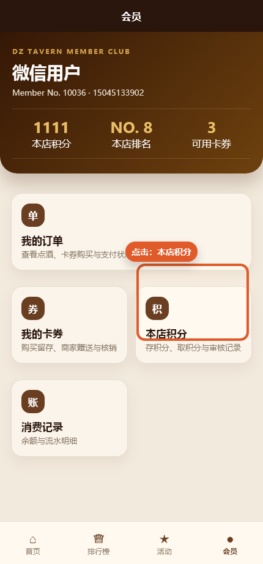
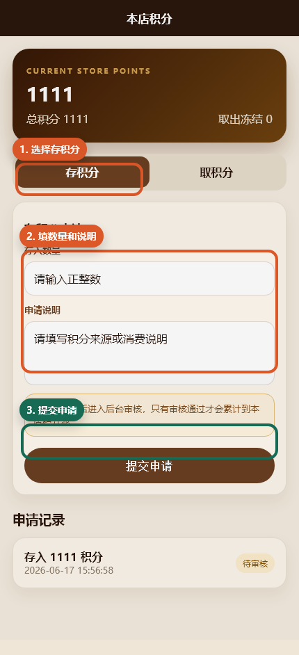
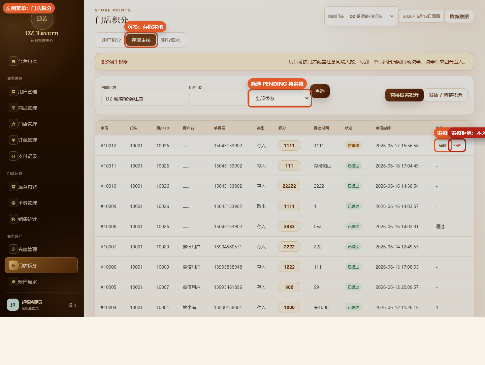
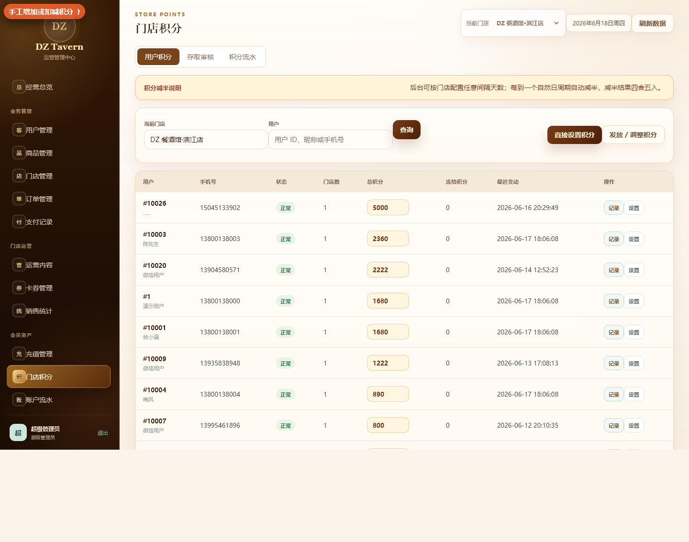
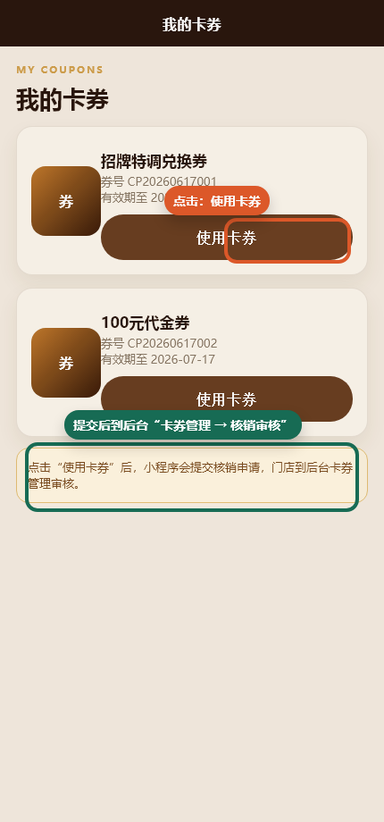
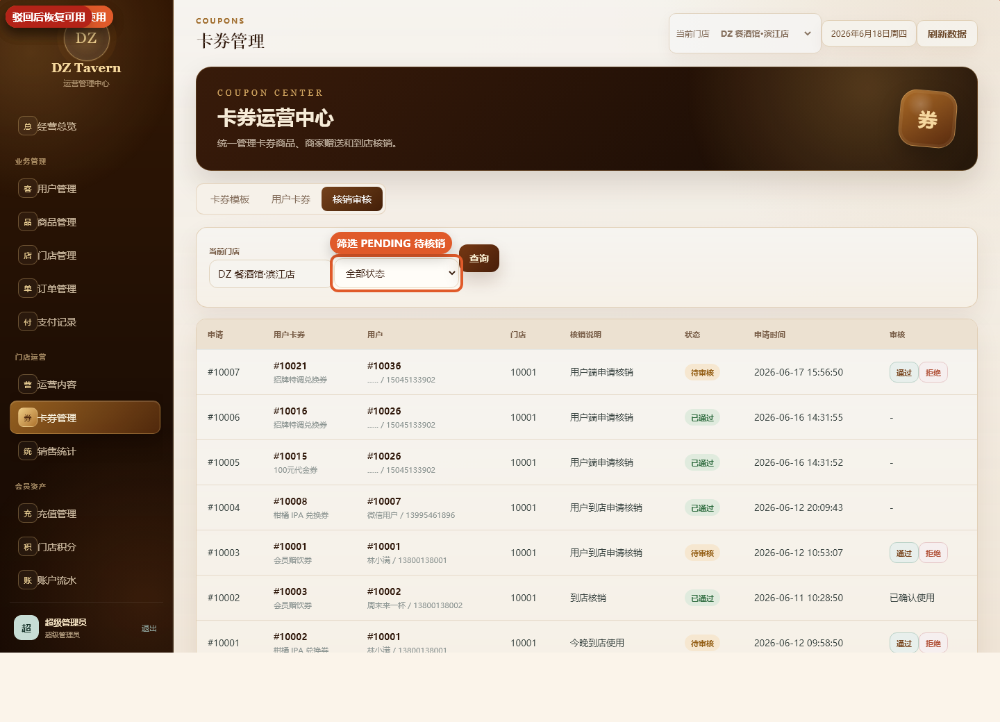
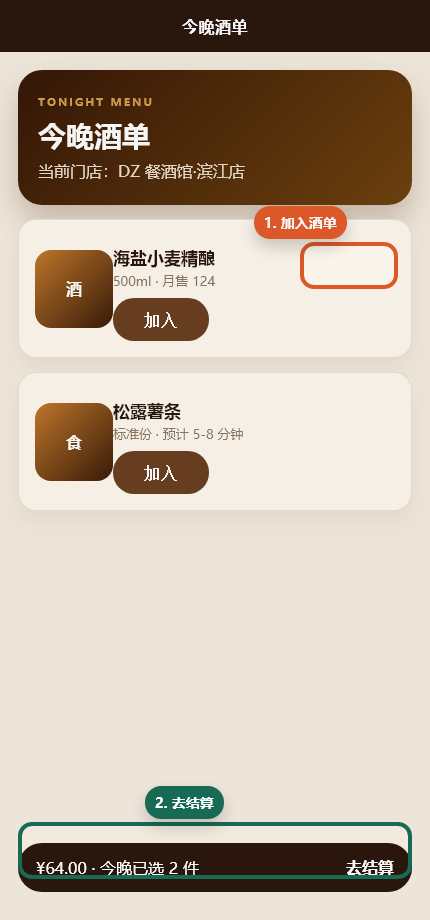
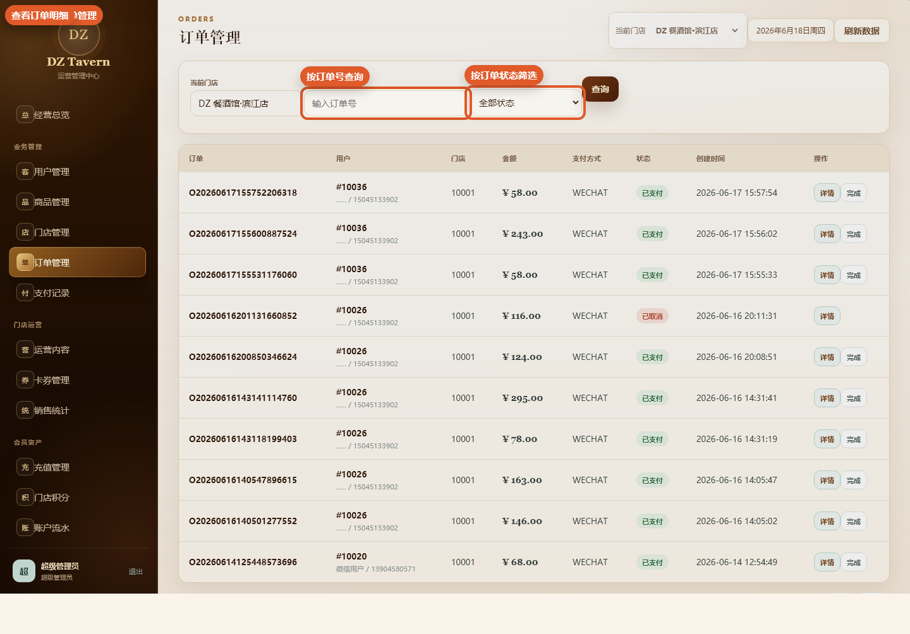
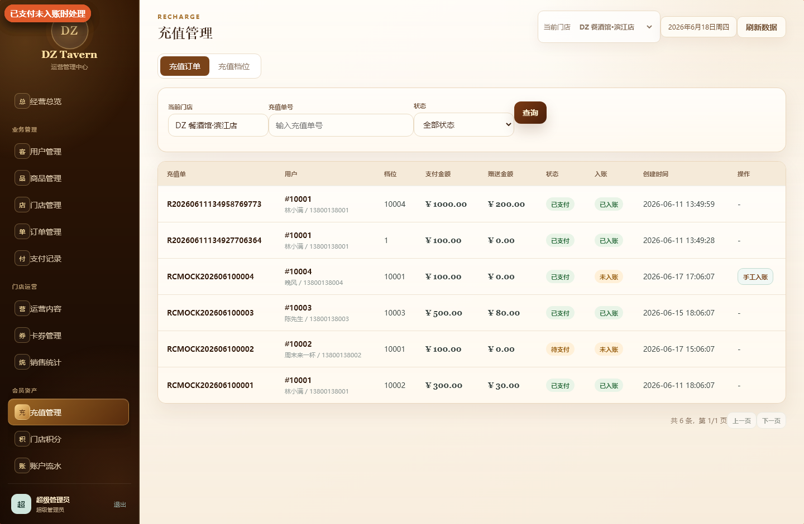
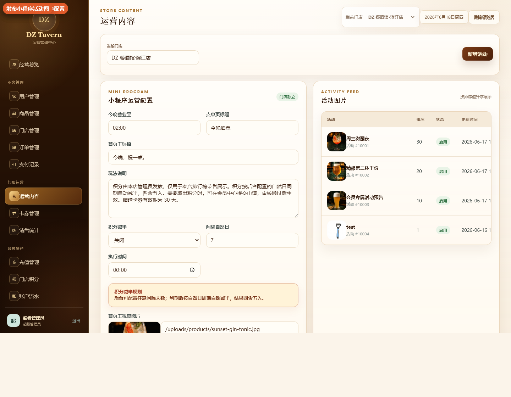

# DZ Tavern 操作手册

> 适用范围：管理后台 `F:/works/dz`，微信小程序 `F:/dz_wechat`。  
> 后台入口建议使用 `http://127.0.0.1:8081/admin/`，注意末尾有 `/`。  
> 本手册中的后台图片来自本地实际后台页面；小程序图片为根据 `F:/dz_wechat` 页面源码生成的操作位置示意图。

## 1. 业务位置速查

| 小程序端操作 | 用户操作位置 | 后台处理位置 | 后台处理动作 |
|---|---|---|---|
| 存积分 | 会员 → 本店积分 → 存积分 | 会员资产 → 门店积分 → 存取审核 | 查 `PENDING` 待审核记录，点“通过”或“拒绝” |
| 取积分 | 会员 → 本店积分 → 取积分 | 会员资产 → 门店积分 → 存取审核 | 通过后正式扣减冻结积分，拒绝后解冻退回 |
| 查看本店积分流水 | 会员 → 本店积分 | 会员资产 → 门店积分 → 积分流水 | 按用户 ID 查询积分变动 |
| 使用卡券 | 会员 → 我的卡券 → 使用卡券 | 门店运营 → 卡券管理 → 核销审核 | 点“通过”确认使用，点“拒绝”恢复可用 |
| 购买卡券 | 首页 → 卡券中心 → 加入卡券清单 → 支付 | 门店运营 → 卡券管理 → 用户卡券 | 查看用户已获得卡券；核销走“核销审核” |
| 点酒下单 | 首页 → 今晚酒单 → 去结算 → 支付 | 业务管理 → 订单管理 | 查看订单详情，必要时点“完成” |
| 支付记录查询 | 支付后自动生成 | 业务管理 → 支付记录 | 按订单号或支付状态查询 |
| 会员充值 | 会员余额页面 → 选择充值档位 → 确认充值 | 会员资产 → 充值管理 → 充值订单 | 查看充值单；已支付未入账时点“手工入账” |
| 充值档位维护 | 小程序展示充值档位 | 会员资产 → 充值管理 → 充值档位 | 新增、编辑、删除充值档位 |
| 首页活动图 | 首页 → 活动入口展示 | 门店运营 → 运营内容 | 新增活动、上下架活动图 |
| 首页玩法说明 | 首页 → 玩法说明 | 门店运营 → 运营内容 | 编辑门店配置中的玩法说明 |
| 商品酒单 | 首页 → 今晚酒单 | 业务管理 → 商品管理 | 新增商品、编辑 SKU、上下架商品 |
| 门店切换 | 小程序首页门店选择 | 业务管理 → 门店管理 | 新增、编辑、启用/停用门店 |

## 2. 登录后台

1. 打开 `http://127.0.0.1:8081/admin/`。
2. 账号填写 `admin`。
3. 密码以部署时设置的管理员密码为准。
4. 点击“进入后台”。


进入后台后，顶部可切换“当前门店”。如果处理的是某个门店的小程序业务，先确认顶部门店是否正确。


## 3. 小程序存积分 / 取积分审核

结论：小程序“存积分”提交后，到后台 `会员资产 → 门店积分 → 存取审核` 处理。

### 小程序端操作

1. 打开小程序底部“会员”。
2. 点击“本店积分”。



3. 在“本店积分”页面选择“存积分”或“取积分”。
4. 输入积分数量。
5. 填写申请说明。
6. 点击“提交申请”。



### 后台审核操作

1. 登录后台。
2. 左侧菜单进入 `会员资产 → 门店积分`。
3. 点击页签“存取审核”。
4. 状态筛选选择 `PENDING` 或保留“全部状态”查看待审核记录。
5. 找到对应用户、手机号、积分数量和用途说明。
6. 点击“通过”或“拒绝”，填写审核备注后确认。

处理规则：

- `存入`：审核通过后，积分才会累计到用户的本店积分池。
- `存入`：审核拒绝后，不增加用户积分。
- `取出`：提交后先冻结；审核通过后正式扣减冻结积分。
- `取出`：审核拒绝后，冻结积分会解冻并退回用户可用积分。



后台也可以在 `会员资产 → 门店积分 → 用户积分` 中按用户查询积分，并进行“直接设置积分”或“发放 / 调整积分”。这类操作是后台主动调整，不是处理用户提交的存取申请。



## 4. 小程序卡券核销

小程序用户点击“使用卡券”后，不会直接核销成功，而是提交一条核销申请；门店需要到后台审核。

### 小程序端操作

1. 打开小程序底部“会员”。
2. 点击“我的卡券”。
3. 找到要使用的卡券。
4. 点击“使用卡券”。



### 后台审核操作

1. 登录后台。
2. 左侧菜单进入 `门店运营 → 卡券管理`。
3. 点击页签“核销审核”。
4. 状态筛选选择 `PENDING` 待核销。
5. 核对用户、卡券名称、核销说明。
6. 到店确认后点“通过”；不符合使用条件时点“拒绝”。

处理规则：

- 审核通过：用户卡券变为已使用。
- 审核拒绝：未过期卡券恢复为可用状态。



## 5. 点酒下单与订单处理

### 小程序端操作

1. 首页点击“今晚酒单”或进入菜单页。
2. 选择商品规格并加入酒单。
3. 点击底部“去结算”。
4. 选择支付方式并提交订单。



### 后台订单处理

1. 登录后台。
2. 左侧菜单进入 `业务管理 → 订单管理`。
3. 可按订单号、订单状态查询。
4. 点击“详情”查看订单商品、金额、支付方式和备注。
5. 对已支付且已完成出品的订单，可在列表中点击“完成”。



支付相关记录在 `业务管理 → 支付记录` 查看，适合按订单号排查微信支付、余额支付、退款或支付状态。

## 6. 会员充值与手工入账

### 小程序端操作

1. 打开会员余额页面。
2. 选择充值档位。
3. 点击“确认充值”并完成支付。

### 后台处理

1. 登录后台。
2. 左侧菜单进入 `会员资产 → 充值管理`。
3. 默认页签“充值订单”用于查看用户充值单。
4. 如果出现“已支付 / 未入账”的充值单，点击“手工入账”。
5. 页签“充值档位”用于维护小程序展示的充值金额和赠送金额。



注意：手工入账只处理“已支付但未入账”的充值单，操作前必须核对充值单号、用户、支付金额和入账状态。

## 7. 商品、门店与运营内容

### 商品管理

后台位置：`业务管理 → 商品管理`

常用操作：

- “新增商品”：新增小程序酒单商品或卡券关联商品。
- “编辑”：维护商品名称、图片、描述、分类、SKU、价格、库存。
- “上架 / 下架”：控制小程序是否可见可买。
- “分类管理”：维护菜单分类。
- “首页公告”：维护首页公告内容。

### 门店管理

后台位置：`业务管理 → 门店管理`

常用操作：

- 新增门店。
- 编辑门店名称、地址、联系电话。
- 启用 / 停用门店。

小程序首页的门店选择来自后台启用的门店，处理订单、积分、卡券前应确认当前门店。

### 运营内容

后台位置：`门店运营 → 运营内容`

常用操作：

- 编辑门店首页配置：营业结束时间、首页标语、玩法说明、菜单标题、积分减半配置。
- 上传首页图。
- 新增活动图。
- 启用 / 停用活动图。



## 8. 用户、流水、日志和对账

### 用户管理

后台位置：`业务管理 → 用户管理`

常用操作：

- 按昵称、手机号、OpenID 查询用户。
- 查看用户详情，包括余额、积分、冻结积分。
- 启用 / 停用用户。

### 账户流水

后台位置：`会员资产 → 账户流水`

常用操作：

- 按用户 ID、变更类型、业务单号查询余额和积分流水。
- 导出 CSV。
- 进行“资产调整”。

注意：资产调整会直接影响用户余额或积分，操作前必须核对用户 ID、资产类型、调整值和原因。

### 操作日志

后台位置：`系统审计 → 操作日志`

用于追踪管理员在商品、订单、积分、充值、卡券等模块的关键操作。

### 每日对账

后台位置：`系统审计 → 每日对账`

用于按业务日期核对订单与支付记录，建议对昨日数据执行，避免当天交易尚未完成造成差异。

## 9. 常见问题

### 小程序存积分后后台看不到

优先检查：

1. 后台顶部“当前门店”是否与小程序当前门店一致。
2. `门店积分 → 存取审核` 是否筛选了错误状态。
3. 是否按错误用户 ID 查询。
4. 用户是否实际点了“提交申请”。

### 小程序卡券点了使用，后台哪里审核

后台位置：`门店运营 → 卡券管理 → 核销审核`。筛选 `PENDING` 后处理。

### 充值已支付但余额没增加

后台位置：`会员资产 → 充值管理 → 充值订单`。查到“已支付 / 未入账”后，核对无误再点“手工入账”。

### 后台页面资源加载异常

本地访问后台时请使用：

```text
http://127.0.0.1:8081/admin/
```

不要省略末尾 `/`。

