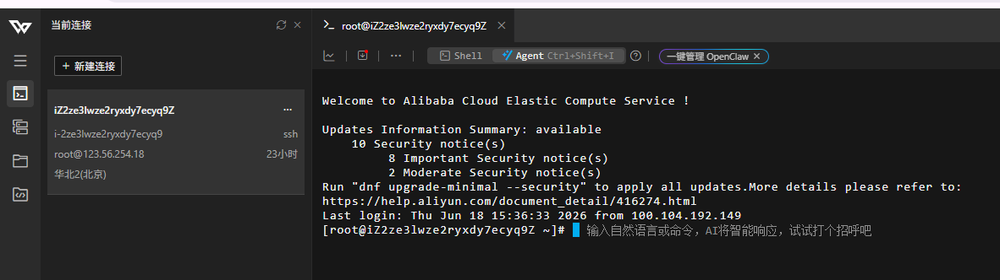
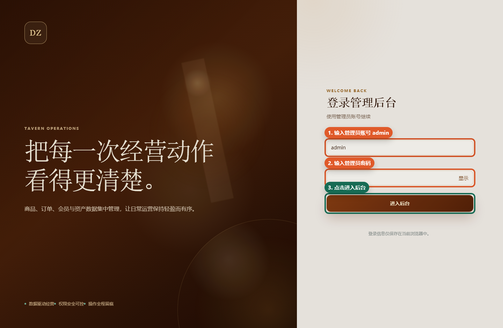

# DZ Tavern 管理后台云服务器部署照做版

> 适合场景：你已经打开了云服务器控制台或 SSH 终端，但不知道每一步具体点哪里、输入什么。  
> 当前项目：`F:\works\dz`  
> 当前后台模块：`dz-admin`  
> 最终访问地址：`http://服务器IP/admin/` 或 `https://你的域名/admin/`

## 0. 先确认你正在用哪台服务器

你前面发的两张图里出现了两个不同的服务器 IP：

| 截图 | 平台 | IP |
|---|---|---|
| 轻量云服务器列表 | 腾讯云 | `124.223.114.222` |
| 当前 SSH 终端 | 阿里云 ECS | `123.56.254.18` |

下面所有命令里的 `你的服务器IP` 都要替换成你最终要部署的那台服务器 IP。

如果你现在就想在第二张终端里的服务器上操作，那就把 `你的服务器IP` 替换成：

```text
123.56.254.18
```

当前终端示例：



## 1. 登录服务器

### 1.1 控制台网页登录

操作位置：腾讯云或阿里云网页控制台。

具体操作：

1. 打开云服务器控制台。
2. 找到要部署的服务器。
3. 确认服务器状态是“运行中”。
4. 点击“登录”。
5. 选择“网页登录”或“Workbench 登录”。
6. 进入黑色终端页面后，看到类似下面内容就说明登录成功：

```text
[root@服务器名 ~]#
```

### 1.2 本地 PowerShell 登录

操作位置：你自己电脑的 PowerShell。

如果服务器支持密码登录：

```powershell
ssh root@你的服务器IP
```

例如当前阿里云截图里的服务器：

```powershell
ssh root@123.56.254.18
```

如果服务器使用密钥登录：

```powershell
ssh -i C:\你的密钥路径\server.pem root@你的服务器IP
```

看到下面这种提示，就说明已经进入服务器：

```text
[root@服务器名 ~]#
```

## 2. 放行端口

管理后台最终通过浏览器访问，所以云服务器必须放行端口。

### 2.1 腾讯云放行端口

操作位置：腾讯云控制台。

具体操作：

1. 进入“轻量应用服务器”。
2. 点击你的服务器卡片。
3. 找到“防火墙”或“防火墙规则”。
4. 点击“添加规则”。
5. 添加以下规则：

| 应用类型 | 协议 | 端口 | 来源 |
|---|---|---|---|
| SSH | TCP | `22` | 你的电脑公网 IP，临时也可用 `0.0.0.0/0` |
| HTTP | TCP | `80` | `0.0.0.0/0` |
| HTTPS | TCP | `443` | `0.0.0.0/0` |
| 宝塔面板 | TCP | `8888` | 你的电脑公网 IP，临时也可用 `0.0.0.0/0` |

不建议长期放行：

| 端口 | 原因 |
|---|---|
| `3306` | MySQL 不应该暴露到公网 |
| `8081` | 后台服务端口应由 Nginx 代理，不直接暴露公网 |

### 2.2 阿里云放行端口

操作位置：阿里云 ECS 控制台。

具体操作：

1. 进入“ECS 云服务器”。
2. 点击左侧“实例与镜像”。
3. 点击你的服务器实例。
4. 找到“安全组”。
5. 点击当前安全组名称。
6. 进入“入方向”规则。
7. 点击“手动添加”。
8. 添加以下规则：

| 授权策略 | 协议类型 | 端口范围 | 授权对象 |
|---|---|---|---|
| 允许 | SSH(22) | `22/22` | 你的电脑公网 IP，临时也可用 `0.0.0.0/0` |
| 允许 | HTTP(80) | `80/80` | `0.0.0.0/0` |
| 允许 | HTTPS(443) | `443/443` | `0.0.0.0/0` |
| 允许 | 自定义TCP | `8888/8888` | 你的电脑公网 IP，临时也可用 `0.0.0.0/0` |

## 3. 确认有没有宝塔面板

操作位置：服务器黑色终端。

输入：

```bash
bt default
```

### 3.1 如果显示宝塔地址

看到类似内容就说明已经安装宝塔：

```text
Bt-Panel: http://服务器IP:8888/xxxx
username: xxxxx
password: xxxxx
```

接下来：

1. 复制 `Bt-Panel` 地址。
2. 在浏览器打开。
3. 输入 username 和 password。
4. 进入宝塔面板。

### 3.2 如果提示 `bt: command not found`

说明这台服务器大概率不是宝塔镜像。

建议选择其中一种方式：

| 方式 | 适合情况 |
|---|---|
| 重装系统为“宝塔 Linux 面板”镜像 | 新服务器、没有重要数据，最省事 |
| 去宝塔官网复制最新安装命令安装 | 服务器已有系统，不想重装 |
| 不使用宝塔，纯命令安装 Nginx/MySQL/JDK | 熟悉 Linux 运维时使用 |

如果服务器里还没有重要数据，最简单的是在云控制台重装为“宝塔 Linux 面板”镜像。重装系统会清空服务器数据，执行前必须确认服务器里没有要保留的内容。

## 4. 在宝塔安装运行环境

操作位置：宝塔面板。

进入宝塔后，如果第一次打开会弹出“推荐安装套件”，可以选 LNMP。

需要安装：

| 软件 | 版本建议 |
|---|---|
| Nginx | 最新稳定版 |
| MySQL | `8.0` |
| Java/JDK | `17` |

具体操作：

1. 点击左侧“软件商店”。
2. 搜索 `Nginx`。
3. 点击“安装”。
4. 搜索 `MySQL`。
5. 选择 `MySQL 8.0` 安装。
6. 搜索 `Java`、`JDK` 或“Java 项目管理器”。
7. 安装 `JDK 17`。

安装后回到服务器终端验证：

```bash
java -version
```

成功时会看到类似：

```text
openjdk version "17.x.x"
```

再确认 Java 命令路径：

```bash
which java
```

常见结果：

```text
/usr/bin/java
```

后面配置 `systemd` 时会用到这个路径。

## 5. 创建数据库

推荐用宝塔页面创建，简单不容易输错。

操作位置：宝塔面板。

具体操作：

1. 点击左侧“数据库”。
2. 点击“添加数据库”。
3. 数据库名填写：

```text
dz
```

4. 用户名填写：

```text
dz_app
```

5. 密码点击“随机”或自己设置强密码。
6. 访问权限选择“本地服务器”。
7. 字符集选择：

```text
utf8mb4
```

8. 点击“提交”。
9. 记录数据库密码，后面要填到 `DB_PASSWORD`。

如果你不用宝塔，也可以在服务器终端进入 MySQL 后执行：

```bash
mysql -uroot -p
```

然后输入 MySQL root 密码，再执行：

```sql
CREATE DATABASE IF NOT EXISTS dz
  DEFAULT CHARACTER SET utf8mb4
  DEFAULT COLLATE utf8mb4_0900_ai_ci;

CREATE USER IF NOT EXISTS 'dz_app'@'localhost' IDENTIFIED BY '换成你的数据库强密码';
CREATE USER IF NOT EXISTS 'dz_app'@'127.0.0.1' IDENTIFIED BY '换成你的数据库强密码';

GRANT SELECT, INSERT, UPDATE, DELETE, CREATE, ALTER, INDEX, REFERENCES
ON dz.* TO 'dz_app'@'localhost';

GRANT SELECT, INSERT, UPDATE, DELETE, CREATE, ALTER, INDEX, REFERENCES
ON dz.* TO 'dz_app'@'127.0.0.1';

FLUSH PRIVILEGES;
EXIT;
```

## 6. 本地打包管理后台

操作位置：你自己电脑的 PowerShell，不是在服务器终端。

输入：

```powershell
cd F:\works\dz
mvn clean package '-DskipTests'
```

等待命令结束。

看到类似下面内容就是打包成功：

```text
BUILD SUCCESS
```

打包成功后确认 jar 是否存在：

```powershell
Test-Path F:\works\dz\dz-admin\target\dz-admin-1.0.0-SNAPSHOT.jar
```

如果输出：

```text
True
```

说明 jar 文件已经生成。

## 7. 在服务器创建部署目录

操作位置：服务器黑色终端。

输入：

```bash
mkdir -p /www/wwwroot/dz-admin
mkdir -p /www/wwwlogs/dz-admin
mkdir -p /www/backup/dz-admin
mkdir -p /www/wwwroot/dz-admin/uploads
```

验证目录：

```bash
ls -ld /www/wwwroot/dz-admin /www/wwwlogs/dz-admin /www/backup/dz-admin
```

看到目录列表就说明创建成功。

## 8. 上传 jar 到服务器

推荐方式一：宝塔上传。

### 8.1 用宝塔上传

操作位置：宝塔面板。

具体操作：

1. 点击左侧“文件”。
2. 进入目录：

```text
/www/wwwroot/dz-admin
```

3. 点击“上传”。
4. 选择本地文件：

```text
F:\works\dz\dz-admin\target\dz-admin-1.0.0-SNAPSHOT.jar
```

5. 上传完成后，把文件重命名为：

```text
app.jar
```

### 8.2 用 PowerShell 上传

操作位置：你自己电脑的 PowerShell。

如果当前要传到阿里云截图里的服务器：

```powershell
scp F:\works\dz\dz-admin\target\dz-admin-1.0.0-SNAPSHOT.jar root@123.56.254.18:/www/wwwroot/dz-admin/app.jar
```

如果传到腾讯云截图里的服务器：

```powershell
scp F:\works\dz\dz-admin\target\dz-admin-1.0.0-SNAPSHOT.jar root@124.223.114.222:/www/wwwroot/dz-admin/app.jar
```

如果你换了服务器，就把 IP 改成你的实际 IP。

上传后回到服务器终端验证：

```bash
ls -lh /www/wwwroot/dz-admin/app.jar
```

看到文件大小不是 `0` 就说明上传成功。

## 9. 配置后台环境变量

操作位置：服务器黑色终端。

先生成一个 `JWT_SECRET`：

```bash
openssl rand -hex 32
```

复制输出结果，后面填到 `JWT_SECRET`。

然后创建环境变量文件：

```bash
cat > /www/wwwroot/dz-admin/dz-admin.env <<'EOF'
DB_URL=jdbc:mysql://127.0.0.1:3306/dz?useUnicode=true&characterEncoding=utf8&serverTimezone=Asia/Shanghai&allowPublicKeyRetrieval=true&useSSL=false
DB_USERNAME=dz_app
DB_PASSWORD=换成第5步创建数据库时的密码
JWT_SECRET=换成openssl生成的32位以上随机字符串
ADMIN_INITIAL_PASSWORD=换成后台admin登录密码
WECHAT_MOCK_ENABLED=true
WECHAT_AUTH_MOCK_ENABLED=false
WECHAT_APP_ID=换成你的小程序AppID
WECHAT_APP_SECRET=换成你的小程序AppSecret
UPLOAD_ROOT=/www/wwwroot/dz-admin/uploads
EOF
```

必须替换的值：

| 配置 | 怎么填 |
|---|---|
| `DB_PASSWORD` | 第 5 步创建 `dz_app` 数据库用户时设置的密码 |
| `JWT_SECRET` | `openssl rand -hex 32` 生成的值 |
| `ADMIN_INITIAL_PASSWORD` | 你自己设置一个后台登录强密码 |
| `WECHAT_APP_ID` | 小程序 AppID |
| `WECHAT_APP_SECRET` | 小程序 AppSecret |

如果暂时只想先跑通后台，微信配置可以先留空：

```env
WECHAT_APP_ID=
WECHAT_APP_SECRET=
```

保存后收紧权限：

```bash
chmod 600 /www/wwwroot/dz-admin/dz-admin.env
```

检查文件是否存在：

```bash
ls -lh /www/wwwroot/dz-admin/dz-admin.env
```

注意：不要把 `dz-admin.env` 的内容截图发给别人，里面有数据库密码和密钥。

## 10. 配置 systemd 后台运行

操作位置：服务器黑色终端。

先确认 Java 路径：

```bash
which java
```

如果输出是 `/usr/bin/java`，直接复制下面命令。

```bash
cat > /etc/systemd/system/dz-admin.service <<'EOF'
[Unit]
Description=DZ Tavern Admin Service
After=network.target mysqld.service

[Service]
Type=simple
WorkingDirectory=/www/wwwroot/dz-admin
EnvironmentFile=/www/wwwroot/dz-admin/dz-admin.env
ExecStart=/usr/bin/java -jar /www/wwwroot/dz-admin/app.jar
Restart=always
RestartSec=5
SuccessExitStatus=143
StandardOutput=append:/www/wwwlogs/dz-admin/admin.out.log
StandardError=append:/www/wwwlogs/dz-admin/admin.err.log

[Install]
WantedBy=multi-user.target
EOF
```

如果 `which java` 输出不是 `/usr/bin/java`，就把上面这一行里的 `/usr/bin/java` 改成实际输出：

```ini
ExecStart=/usr/bin/java -jar /www/wwwroot/dz-admin/app.jar
```

让配置生效并启动：

```bash
systemctl daemon-reload
systemctl enable dz-admin
systemctl start dz-admin
```

查看运行状态：

```bash
systemctl status dz-admin --no-pager
```

成功时重点看这几个字：

```text
Active: active (running)
```

如果启动失败，查看日志：

```bash
journalctl -u dz-admin -n 100 --no-pager
```

也可以看文件日志：

```bash
tail -n 100 /www/wwwlogs/dz-admin/admin.out.log
tail -n 100 /www/wwwlogs/dz-admin/admin.err.log
```

## 11. 验证后台服务在服务器本机可用

操作位置：服务器黑色终端。

输入：

```bash
curl -I http://127.0.0.1:8081/admin/
```

成功时会看到类似：

```text
HTTP/1.1 200
```

或：

```text
HTTP/1.1 302
```

再测试登录接口：

```bash
curl -X POST http://127.0.0.1:8081/admin-api/auth/login \
  -H "Content-Type: application/json" \
  -d '{"username":"admin","password":"换成你设置的ADMIN_INITIAL_PASSWORD"}'
```

如果返回内容里有 `token`，说明后台接口已经正常。

如果这里失败，先不要配置 Nginx，先看第 16 节排查。

## 12. 配置 Nginx 反向代理

推荐用宝塔页面配置。

### 12.1 宝塔添加网站

操作位置：宝塔面板。

具体操作：

1. 点击左侧“网站”。
2. 点击“添加站点”。
3. 如果你有域名，域名填写你的域名，例如：

```text
admin.example.com
```

4. 如果你暂时没有域名，可以先填写服务器 IP，例如：

```text
123.56.254.18
```

5. PHP 版本选择“纯静态”或“不使用 PHP”。
6. 根目录可以保持宝塔默认值。
7. 点击“提交”。

### 12.2 添加反向代理

操作位置：宝塔面板。

具体操作：

1. 在“网站”列表里找到刚创建的网站。
2. 点击右侧“设置”。
3. 点击“反向代理”。
4. 点击“添加反向代理”。
5. 填写：

| 字段 | 值 |
|---|---|
| 代理名称 | `dz-admin` |
| 目标 URL | `http://127.0.0.1:8081` |
| 发送域名 | `$host` |
| 内容替换 | 不填 |

6. 点击“提交”。

### 12.3 如果宝塔反向代理不好用

可以打开站点设置里的“配置文件”，把 `server` 配置调整为类似下面内容。

把 `server_name` 改成你的域名或 IP：

```nginx
server {
    listen 80;
    server_name 你的域名或服务器IP;

    client_max_body_size 20m;

    location / {
        proxy_pass http://127.0.0.1:8081;
        proxy_http_version 1.1;
        proxy_set_header Host $host;
        proxy_set_header X-Real-IP $remote_addr;
        proxy_set_header X-Forwarded-For $proxy_add_x_forwarded_for;
        proxy_set_header X-Forwarded-Proto $scheme;
    }
}
```

保存后在服务器终端检查 Nginx：

```bash
nginx -t
systemctl reload nginx
```

如果 `nginx -t` 报错，不要继续重载，把报错内容贴出来先排查。

## 13. 浏览器访问后台

操作位置：你的电脑浏览器。

如果使用阿里云截图里的服务器：

```text
http://123.56.254.18/admin/
```

如果使用腾讯云截图里的服务器：

```text
http://124.223.114.222/admin/
```

如果绑定了域名：

```text
http://你的域名/admin/
```

看到登录页后输入：

```text
账号：admin
密码：第9步 ADMIN_INITIAL_PASSWORD 设置的值
```

登录页参考：



登录成功后首页参考：


## 14. 配置 HTTPS

有域名时再做 HTTPS。只有 IP 时可以先跳过。

操作位置：宝塔面板。

具体操作：

1. 域名 DNS 里添加 `A` 记录，指向服务器 IP。
2. 回到宝塔面板。
3. 点击“网站”。
4. 找到你的站点，点击“设置”。
5. 点击“SSL”。
6. 选择 Let's Encrypt。
7. 勾选你的域名。
8. 点击“申请”。
9. 申请成功后打开“强制 HTTPS”。
10. 浏览器访问：

```text
https://你的域名/admin/
```

## 15. 后续更新版本

以后代码改了，要重新部署后台，按下面做。

### 15.1 本地重新打包

操作位置：你自己电脑的 PowerShell。

```powershell
cd F:\works\dz
mvn clean package '-DskipTests'
```

### 15.2 服务器备份旧版本

操作位置：服务器黑色终端。

```bash
cp /www/wwwroot/dz-admin/app.jar /www/backup/dz-admin/app-$(date +%Y%m%d-%H%M%S).jar
```

### 15.3 上传新 jar

操作位置：你自己电脑的 PowerShell。

阿里云示例：

```powershell
scp F:\works\dz\dz-admin\target\dz-admin-1.0.0-SNAPSHOT.jar root@123.56.254.18:/www/wwwroot/dz-admin/app.jar
```

腾讯云示例：

```powershell
scp F:\works\dz\dz-admin\target\dz-admin-1.0.0-SNAPSHOT.jar root@124.223.114.222:/www/wwwroot/dz-admin/app.jar
```

### 15.4 重启后台

操作位置：服务器黑色终端。

```bash
systemctl restart dz-admin
systemctl status dz-admin --no-pager
```

看到：

```text
Active: active (running)
```

说明更新成功。

## 16. 常见问题按顺序排查

### 16.1 浏览器打不开

先在服务器终端检查服务：

```bash
systemctl status dz-admin --no-pager
curl -I http://127.0.0.1:8081/admin/
```

如果本机能通，浏览器不能通，通常是安全组、宝塔防火墙或 Nginx 反向代理问题。

### 16.2 页面显示 502

说明 Nginx 找不到后端服务。

执行：

```bash
systemctl status dz-admin --no-pager
journalctl -u dz-admin -n 100 --no-pager
```

重点看是不是数据库密码错、Java 路径错、jar 没上传成功。

### 16.3 启动失败，提示数据库连接失败

检查环境变量：

```bash
grep -E 'DB_URL|DB_USERNAME' /www/wwwroot/dz-admin/dz-admin.env
```

不要把 `DB_PASSWORD` 打印或截图给别人。

再检查 MySQL 是否运行：

```bash
systemctl status mysqld --no-pager
```

有些系统 MySQL 服务名是 `mysql`：

```bash
systemctl status mysql --no-pager
```

### 16.4 首次启动提示必须配置管理员初始密码

说明 `ADMIN_INITIAL_PASSWORD` 没填或为空。

编辑：

```bash
vi /www/wwwroot/dz-admin/dz-admin.env
```

确认有这一行：

```env
ADMIN_INITIAL_PASSWORD=你的后台初始密码
```

保存后重启：

```bash
systemctl restart dz-admin
```

### 16.5 忘记后台密码

`ADMIN_INITIAL_PASSWORD` 只在第一次创建 `admin` 用户时生效。数据库里已经有 `admin` 后，修改环境变量不会自动改密码。

这种情况需要：

1. 通过后台已有“修改密码”功能修改。
2. 或写数据库维护脚本重置 BCrypt 密码。
3. 不建议直接手写明文密码进数据库。

## 17. 最小成功标准

全部部署完成后，至少满足以下结果：

- [ ] 服务器里 `systemctl status dz-admin --no-pager` 显示 `active (running)`。
- [ ] 服务器里 `curl -I http://127.0.0.1:8081/admin/` 有响应。
- [ ] 浏览器能打开 `http://服务器IP/admin/`。
- [ ] `admin` 账号能登录。
- [ ] 宝塔或云安全组没有公网开放 `3306`。
- [ ] 正式上线前改成域名和 HTTPS。
