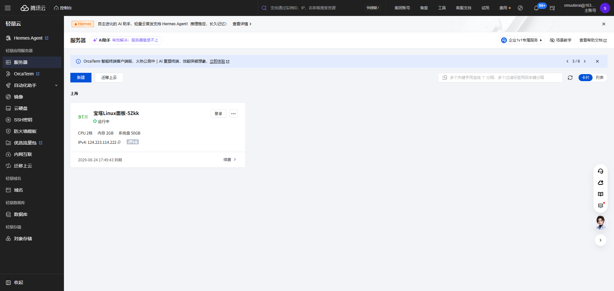

# DZ Tavern 管理后台腾讯云部署手册

> 适用项目：`F:\works\dz`  
> 适用模块：`dz-admin` 管理后台  
> 推荐方案：腾讯云轻量应用服务器 + 宝塔 Linux 面板 + MySQL 8 + JDK 17 + Nginx 反向代理  
> 后台访问路径：`http://服务器IP/admin/` 或 `https://你的域名/admin/`
> 如果需要从登录服务器开始一步步操作，请直接看：[部署照做版](tencent-cloud-admin-deploy-step-by-step.md)。

## 1. 部署结论

`dz-admin` 不是独立前端项目，它是一个 Spring Boot 管理端服务。后台页面已经放在 `dz-admin/src/main/resources/static/admin/`，打包后会一起进入 `dz-admin-1.0.0-SNAPSHOT.jar`。

所以部署时只需要：

1. 在服务器准备 JDK 17、MySQL 8、Nginx。
2. 本地打包 `dz-admin` jar。
3. 上传 jar 到腾讯云服务器。
4. 配置数据库连接、JWT 密钥、管理员初始密码等环境变量。
5. 用 `systemd` 守护 `java -jar` 进程。
6. 用宝塔/Nginx 把公网 `80/443` 转发到本机 `8081`。

> 你截图里的服务器公网 IP 是 `124.223.114.222`。下面命令里会用 `你的服务器IP` 表示，请按实际 IP 或域名替换。

## 2. 截图参考

### 2.1 腾讯云轻量服务器列表

进入腾讯云控制台，确认服务器处于“运行中”，记录公网 IP，然后点击服务器卡片右侧的“登录”。



### 2.2 后台登录页

部署成功后访问：

```text
http://你的服务器IP/admin/
```

如果绑定了域名并配置 HTTPS，则访问：

```text
https://你的域名/admin/
```

登录账号默认是：

```text
账号：admin
密码：服务器环境变量 ADMIN_INITIAL_PASSWORD 设置的值
```


### 2.3 后台首页

登录成功后应进入管理后台首页。


## 3. 服务器准备

### 3.1 腾讯云安全组/防火墙

在腾讯云控制台或宝塔面板里放行以下端口：

| 端口 | 用途 | 是否建议公网开放 |
|---|---|---|
| `22` | SSH 登录服务器 | 需要，建议限制来源 IP |
| `80` | HTTP 访问后台 | 需要 |
| `443` | HTTPS 访问后台 | 推荐 |
| `8888` | 宝塔面板默认端口 | 可临时开放，建议限制来源 IP |
| `8081` | `dz-admin` 内部端口 | 不建议长期公网开放 |
| `3306` | MySQL | 不要公网开放 |

推荐最终只对公网开放 `80`、`443`、受限来源的 `22` 和宝塔面板端口。`8081` 只给 Nginx 在服务器本机访问。

### 3.2 SSH 登录服务器

可以在腾讯云控制台点击“登录”，也可以在本地 PowerShell 使用 SSH：

```powershell
ssh root@你的服务器IP
```

如果服务器使用密钥登录：

```powershell
ssh -i C:\path\to\your-key.pem root@你的服务器IP
```

### 3.3 查看宝塔面板地址

如果服务器镜像已经安装宝塔，SSH 登录后执行：

```bash
bt default
```

记录宝塔面板地址、用户名、密码，然后在浏览器打开宝塔面板。

## 4. 安装运行环境

在宝塔面板的软件商店安装：

1. `Nginx`
2. `MySQL 8.0`
3. `Java/JDK 17`

安装完成后，在服务器终端确认 Java 版本：

```bash
java -version
```

应该看到 `17` 版本，例如：

```text
openjdk version "17.x.x"
```

如果 `java` 命令不存在，需要在宝塔里确认 JDK 是否安装成功，或者查看 Java 路径：

```bash
which java
```

后续 `systemd` 配置里的 `ExecStart=/usr/bin/java` 要和这里的路径一致。

## 5. 创建数据库

可以在宝塔面板“数据库”里创建：

| 配置项 | 建议值 |
|---|---|
| 数据库名 | `dz` |
| 用户名 | `dz_app` |
| 密码 | 使用强密码 |
| 字符集 | `utf8mb4` |

也可以在服务器 MySQL 里执行：

```sql
CREATE DATABASE IF NOT EXISTS dz
  DEFAULT CHARACTER SET utf8mb4
  DEFAULT COLLATE utf8mb4_0900_ai_ci;

CREATE USER IF NOT EXISTS 'dz_app'@'localhost' IDENTIFIED BY '换成你的数据库强密码';
CREATE USER IF NOT EXISTS 'dz_app'@'127.0.0.1' IDENTIFIED BY '换成你的数据库强密码';

GRANT SELECT, INSERT, UPDATE, DELETE, CREATE, ALTER, INDEX, REFERENCES
ON dz.* TO 'dz_app'@'localhost';

GRANT SELECT, INSERT, UPDATE, DELETE, CREATE, ALTER, INDEX, REFERENCES
ON dz.* TO 'dz_app'@'127.0.0.1';

FLUSH PRIVILEGES;
```

注意：项目启动时会执行 `schema.sql`，所以数据库用户需要 `CREATE`、`ALTER`、`INDEX` 等建表权限。

## 6. 本地打包管理后台

在本机 PowerShell 执行：

```powershell
cd F:\works\dz
mvn clean package '-DskipTests'
```

打包成功后会生成：

```text
F:\works\dz\dz-admin\target\dz-admin-1.0.0-SNAPSHOT.jar
```

如果你希望同时跑完整测试，可以去掉 `'-DskipTests'`：

```powershell
mvn clean package
```

## 7. 上传 jar 到服务器

### 7.1 创建服务器目录

SSH 登录服务器后执行：

```bash
mkdir -p /www/wwwroot/dz-admin
mkdir -p /www/wwwlogs/dz-admin
mkdir -p /www/backup/dz-admin
mkdir -p /www/wwwroot/dz-admin/uploads
```

### 7.2 上传文件

方式一：用宝塔面板“文件”功能上传，把 jar 上传到：

```text
/www/wwwroot/dz-admin/app.jar
```

方式二：本地 PowerShell 使用 `scp` 上传：

```powershell
scp F:\works\dz\dz-admin\target\dz-admin-1.0.0-SNAPSHOT.jar root@你的服务器IP:/www/wwwroot/dz-admin/app.jar
```

上传后在服务器确认：

```bash
ls -lh /www/wwwroot/dz-admin/app.jar
```

## 8. 配置环境变量

在服务器创建环境变量文件：

```bash
vi /www/wwwroot/dz-admin/dz-admin.env
```

写入以下内容：

```env
DB_URL=jdbc:mysql://127.0.0.1:3306/dz?useUnicode=true&characterEncoding=utf8&serverTimezone=Asia/Shanghai&allowPublicKeyRetrieval=true&useSSL=false
DB_USERNAME=dz_app
DB_PASSWORD=换成你的数据库强密码
JWT_SECRET=换成至少32位的随机字符串
ADMIN_INITIAL_PASSWORD=换成后台admin初始密码
WECHAT_MOCK_ENABLED=true
WECHAT_AUTH_MOCK_ENABLED=false
WECHAT_APP_ID=换成你的小程序AppID
WECHAT_APP_SECRET=换成你的小程序AppSecret
UPLOAD_ROOT=/www/wwwroot/dz-admin/uploads
```

生成 `JWT_SECRET` 的示例：

```bash
openssl rand -hex 32
```

保存后收紧权限：

```bash
chmod 600 /www/wwwroot/dz-admin/dz-admin.env
```

重要说明：

1. `ADMIN_INITIAL_PASSWORD` 只在数据库里还没有 `admin` 用户时生效。
2. 第一次启动成功创建 `admin` 后，再修改 `ADMIN_INITIAL_PASSWORD` 不会自动改密码。
3. 生产环境不要把 `DB_PASSWORD`、`JWT_SECRET`、`WECHAT_APP_SECRET` 发到聊天工具或截图里。

## 9. 配置 systemd 守护进程

在服务器创建服务文件：

```bash
vi /etc/systemd/system/dz-admin.service
```

写入：

```ini
[Unit]
Description=DZ Tavern Admin Service
After=network.target mysqld.service

[Service]
Type=simple
WorkingDirectory=/www/wwwroot/dz-admin
EnvironmentFile=/www/wwwroot/dz-admin/dz-admin.env
ExecStart=/usr/bin/java -jar /www/wwwroot/dz-admin/app.jar
Restart=always
RestartSec=5
SuccessExitStatus=143
StandardOutput=append:/www/wwwlogs/dz-admin/admin.out.log
StandardError=append:/www/wwwlogs/dz-admin/admin.err.log

[Install]
WantedBy=multi-user.target
```

如果 `which java` 查到的路径不是 `/usr/bin/java`，把 `ExecStart` 改成实际路径。

启动服务：

```bash
systemctl daemon-reload
systemctl enable dz-admin
systemctl start dz-admin
```

查看状态：

```bash
systemctl status dz-admin --no-pager
```

查看日志：

```bash
journalctl -u dz-admin -f
```

也可以看文件日志：

```bash
tail -f /www/wwwlogs/dz-admin/admin.out.log
tail -f /www/wwwlogs/dz-admin/admin.err.log
```

## 10. 本机端口验证

在服务器执行：

```bash
curl -I http://127.0.0.1:8081/admin/
```

看到 `HTTP/1.1 200` 或 `HTTP/1.1 302` 都说明服务已经响应。

再测试登录接口：

```bash
curl -X POST http://127.0.0.1:8081/admin-api/auth/login \
  -H "Content-Type: application/json" \
  -d '{"username":"admin","password":"换成ADMIN_INITIAL_PASSWORD"}'
```

如果返回里有 `token`，说明管理后台接口正常。

## 11. 配置宝塔/Nginx 反向代理

### 11.1 宝塔面板方式

1. 打开宝塔面板。
2. 进入“网站”。
3. 点击“添加站点”。
4. 域名填写你的域名，例如 `admin.example.com`。如果暂时没有域名，可以先填写服务器公网 IP。
5. PHP 版本选择“纯静态”或“不使用 PHP”。
6. 创建站点后进入站点设置。
7. 找到“反向代理”。
8. 添加代理：
   - 代理名称：`dz-admin`
   - 目标 URL：`http://127.0.0.1:8081`
   - 发送域名：`$host`
9. 保存后访问 `http://你的域名/admin/` 或 `http://你的服务器IP/admin/`。

### 11.2 Nginx 手写配置方式

如果你直接改 Nginx 配置，可以使用：

```nginx
server {
    listen 80;
    server_name 你的域名或服务器IP;

    client_max_body_size 20m;

    location / {
        proxy_pass http://127.0.0.1:8081;
        proxy_http_version 1.1;
        proxy_set_header Host $host;
        proxy_set_header X-Real-IP $remote_addr;
        proxy_set_header X-Forwarded-For $proxy_add_x_forwarded_for;
        proxy_set_header X-Forwarded-Proto $scheme;
    }
}
```

检查并重载 Nginx：

```bash
nginx -t
systemctl reload nginx
```

## 12. 配置 HTTPS

如果你已经有域名：

1. 到域名 DNS 控制台添加 `A` 记录，指向腾讯云服务器公网 IP。
2. 等 DNS 生效后，在宝塔站点设置里打开“SSL”。
3. 选择 Let's Encrypt 免费证书。
4. 申请成功后勾选“强制 HTTPS”。
5. 使用 `https://你的域名/admin/` 访问后台。

如果只有公网 IP，通常不能申请 Let's Encrypt 证书，可以先用 HTTP，等绑定域名后再配置 HTTPS。

## 13. 首次登录后台

浏览器访问：

```text
http://你的服务器IP/admin/
```

或：

```text
https://你的域名/admin/
```

登录信息：

```text
账号：admin
密码：ADMIN_INITIAL_PASSWORD 的值
```

登录后建议立刻：

1. 检查后台功能是否能打开。
2. 不要把初始密码发给无关人员。
3. 如果后续增加“修改密码”功能，应第一时间修改默认密码。

## 14. 发布新版本

本地重新打包：

```powershell
cd F:\works\dz
mvn clean package '-DskipTests'
```

服务器备份旧 jar：

```bash
cp /www/wwwroot/dz-admin/app.jar /www/backup/dz-admin/app-$(date +%Y%m%d-%H%M%S).jar
```

上传新 jar 覆盖：

```powershell
scp F:\works\dz\dz-admin\target\dz-admin-1.0.0-SNAPSHOT.jar root@你的服务器IP:/www/wwwroot/dz-admin/app.jar
```

重启服务：

```bash
systemctl restart dz-admin
systemctl status dz-admin --no-pager
```

## 15. 回滚版本

查看备份：

```bash
ls -lh /www/backup/dz-admin
```

选择一个备份文件覆盖回去，例如：

```bash
cp /www/backup/dz-admin/app-20260618-120000.jar /www/wwwroot/dz-admin/app.jar
systemctl restart dz-admin
```

## 16. 常见问题

| 现象 | 常见原因 | 处理方式 |
|---|---|---|
| 浏览器打不开后台 | 腾讯云防火墙或宝塔防火墙没放行 `80/443` | 检查安全组和宝塔安全设置 |
| Nginx 返回 `502` | `dz-admin` 没启动或 `8081` 不通 | 执行 `systemctl status dz-admin` 和 `curl -I http://127.0.0.1:8081/admin/` |
| 启动失败，提示数据库连接失败 | `DB_URL`、`DB_USERNAME`、`DB_PASSWORD` 错误，或 MySQL 未启动 | 检查环境变量和 MySQL 服务 |
| 首次启动失败，提示必须配置管理员初始密码 | 数据库没有 `admin` 用户，且没有配置 `ADMIN_INITIAL_PASSWORD` | 在 `dz-admin.env` 里配置强密码后重启 |
| 修改 `ADMIN_INITIAL_PASSWORD` 后密码没变 | `admin` 用户已经创建，初始密码只首次生效 | 需要通过后台改密码功能或数据库维护 |
| `/admin/` 404 | Nginx 没有完整反代到 `8081`，或 jar 不是最新包 | 确认 `proxy_pass http://127.0.0.1:8081`，重新上传 jar |
| 登录接口 `401` | 密码错误或 token 过期 | 重新登录，检查初始密码 |
| 上传图片失败 | `UPLOAD_ROOT` 目录不存在或权限不足 | 创建 `/www/wwwroot/dz-admin/uploads` 并确认服务用户可写 |

## 17. 上线安全检查清单

上线前建议逐项确认：

- [ ] `DB_PASSWORD` 使用强密码。
- [ ] `JWT_SECRET` 至少 32 位，不能使用示例值。
- [ ] `ADMIN_INITIAL_PASSWORD` 使用强密码。
- [ ] 腾讯云安全组没有开放 `3306`。
- [ ] 腾讯云安全组没有长期开放 `8081`。
- [ ] 宝塔面板端口限制了来源 IP，或至少使用强密码。
- [ ] Nginx 已开启 HTTPS。
- [ ] `/admin/` 可以打开。
- [ ] `/admin-api/auth/login` 可以登录。
- [ ] `systemctl restart dz-admin` 后服务能自动恢复。
- [ ] 数据库已配置定期备份。

## 18. 当前项目相关路径

| 内容 | 路径 |
|---|---|
| 管理端模块 | `dz-admin/` |
| 管理端配置 | `dz-admin/src/main/resources/application.yml` |
| 管理端静态页面 | `dz-admin/src/main/resources/static/admin/` |
| 管理端 jar | `dz-admin/target/dz-admin-1.0.0-SNAPSHOT.jar` |
| Dockerfile | `Dockerfile.admin` |
| Docker Compose | `docker-compose.yml` |
| 后台入口 Controller | `dz-admin/src/main/java/com/dz/tavern/admin/controller/AdminPageController.java` |
| 登录接口 | `/admin-api/auth/login` |
| 后台页面入口 | `/admin/` |
